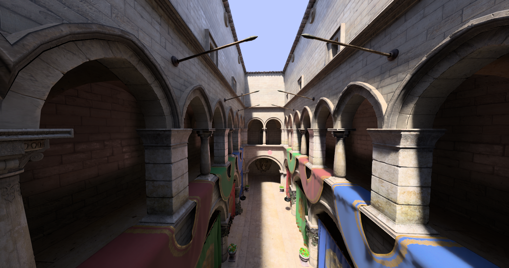

# inMyRoom_vulkan
This is an indie Vulkan graphics engine. Supports glTF 2.0 scenes and has both Windows and Linux support (tested only on x64).
Still in early stage, hope you will find something interesting on it.




### Noticeable Features
* Realtime Path-tracing and Denoising using NRD's reLAX method
* Morphological Anti-Aliasing using Visibility Buffer Multisampling
* 100% homemade collision detection.
* 100% homemade ECS.
* Coded with care and love. Debugged with salt and tears.

### Deps - Submodules
* VulkanMemoryAllocator-Hpp , the usual VMA library but with Vulkan-Hpp binding.
* glfw , window and input library.
* GLM , math library for OpenGL and Vulkan.
* configuru , config file library.
* tinygltf , glTF model import.
* eig3 , eigenvector library for PCA for OBBs.
* NRD , NVIDIA's ray tracing denoisers (reLAX, reBLUR)

# Installation (Compiling)

  First of all, you need a Vulkan-ready graphics driver, a modern C++ compiler, CMake, Git, Vulkan SDK installed and environment variables `VULKAN_SDK_PATH`/`VULKAN_SDK` pointing to the installation path of the SDK.

#### Version Vulkan SDK 1.3.204.1 is preferred
  
  On Linux glfw need X11 development packages installed.
  * On Ubuntu you need:
`xorg-dev`
  * On Fedora :
`libXcursor-devel libXi-devel libXinerama-devel libXrandr-devel`

  Having environment set, download the repo and submodules by running the following command.
```
git clone --depth 1 --recurse-submodules --shallow-submodules https://github.com/thesmallcreeper/inMyRoom_vulkan.git
```

 ## Linux / Windows using CMake
 
 * CMake build inside `/inMyRoom_vulkan` folder.
 * Sponza scene should be able to launch. However in order to launch a scene/game which has a `gameDLL` such as SnakeGame you should go to the game's folder (over at `/inMyRoom_vulkan/testGames/` folder), open the `game_dll` and CMake build it.
   - Make sure scene's/game's `gameConfig.cfg`'s variable `gameDLL/path` is pointing to the .dll or .so just created (if one was needed).
   - Make sure `/inMyRoom_vulkan/config.cfg`'s variable `game/path` is pointing to the game's `gameConfig.cfg` you want to launch.
 * Launch `inMyRoom_vulkan` with the `/inMyRoom_vulkan` as working folder.

