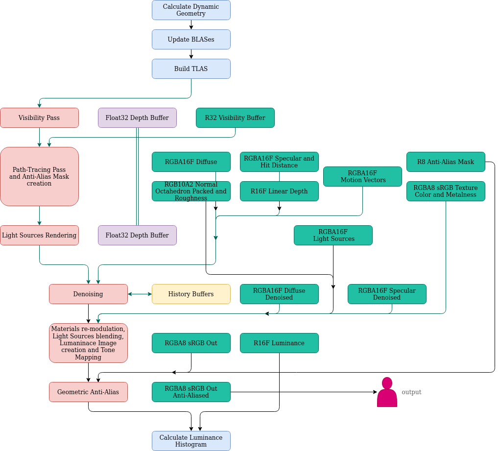

# Rendering System

Bellow there is an overview of the rendering system.
With blue color async compute tasks.  

### More about "Morphological Anti-Aliasing"

Visibility Buffer is rasterized with x8 multisampling (Visibility Pass). Attachment has R32 format.  
The first 12 bits point to which mesh the sample belongs, the rest 20 bits point the triangle of the mesh the sample belongs.

In the next subpass (Path-Tracing Pass and Anti-Alias Mask creation), pixel's samples are grouped by surface.  
It is assumed that two samples belong to the same surface if they share the same triangle or their triangles have at least one pair of points which have almost the same position and the dot product of their normals is greater than 0.99 (8.1 degrees).  
The surface in which the most samples belong to is shaded.
The mean position of the samples inside the selected surface is used for the shading. UVs are found by intersecting the triangle of the sample closest to the mean position .  
For each pixel a 8bit mask is stored, one bit for each of 8 samples, where the samples that belong to the surface that was shaded are flagged.

At the end of frame processing (Geometric Anti-Alias), the mask that was created is used in order to blend each pixel with its 8 neighbor pixels.  
If all samples are flagged that belong to the shaded surface, no blending is needed. If this not true, based on mean position of flagged samples a "compass" is created which points which and by how much 2 of the 8 neighbor pixels should blend together. The result is then blended again with the current pixel in order to create the final output. The weight of second blending is dictated by the population of non-flagged pixels.

Bellow a visualization of the mask that dictates pixels blending.
Where it is more black less samples belong to the shaded surface.  

Bellow a zoom-in comparison of different stages of the frame. 
Note that when MLAA is applied geometric edges get smoothed out.
